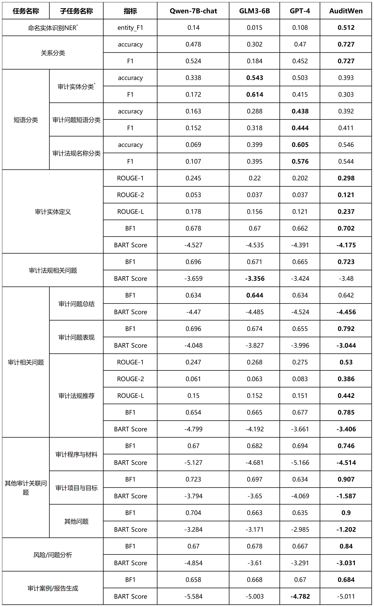

<p align="center">
  
  
</p>

<p align="center">
        🤗 <a href="https://huggingface.co/NAUSCS/Qwen-Audit">Hugging Face</a>
         &nbsp&nbsp | &nbsp&nbsp
        🤖 <a href="https://www.modelscope.cn/models/NAUSCS/AuditWen">ModelScope</a>
<br>
</p>


🎈本项目由开源模型“通义千问”(Tongyi Qwen)微调生成，详细请查看[Notice](./Notice)文件

## 项目简介

&nbsp;&nbsp;&nbsp;&nbsp;&nbsp;&nbsp;&nbsp;&nbsp;本项目旨在以审计行业的实际应用需求为导向，凝练审计智能化任务的需求并转化为大模型任务列表。通过收集和整理审计领域高质量数据集和微调任务指令数据集，基于领域数据的继续预训练和微指令调构建一个服务于审计领域的大语言模型，并结合审计领域知识与数据，在大模型推理阶段使用多种知识增强方式实现对复杂审计问题的理解与回答。

### 背景

&nbsp;&nbsp;&nbsp;&nbsp;&nbsp;&nbsp;&nbsp;&nbsp;审计是根据国家法规和审计准则，由国家授权或受委托的专业机构和人员进行的独立经济监督活动，旨在审查和监督被审计单位的财政、财务收支、经营管理活动及相关资料的真实性、正确性、合规性、合法性和效益性，并评价经济责任，鉴证经济业务。<br>
&nbsp;&nbsp;&nbsp;&nbsp;&nbsp;&nbsp;&nbsp;&nbsp;近年来，随着审计信息化的发展，审计数据基础和方式正在受到大数据的影响，审计对象产生的数据量日益庞大，对现有数据基础和审计方法提出了新挑战。在此背景下，推进以大数据为核心的审计信息化建设，构建大数据审计工作模式，积极开展审计大数据的综合利用至关重要。在智能审计理论探索方面，构建审计知识库并融入数字化甚至智能化审计过程可以降低检查风险、扩大业务覆盖范围，发现更多潜在风险与问题，提升审计工作效率。大数据审计和智能审计已成为审计发展的主流方向，审计智能专家概念的提出表明审计工作正在从自动化转向智能化。<br>
&nbsp;&nbsp;&nbsp;&nbsp;&nbsp;&nbsp;&nbsp;&nbsp;然而，在审计技术方法与实践方面，目前审计数据挖掘主要采用现有文本/数据挖掘算法，较少将人工智能技术与审计领域深入结合，缺乏人工智能技术赋能审计行业的研究。

### 特性

- **专业的智能审计知识问答：** 对于用户输入的问题，AuditWen将智能生成答案，帮助用户解决审计领域的问题。
- **提高工作效率：** 在AuditWen的帮助下，用户可以更快速地解决问题，提高工作效率，节省审计人员的时间和精力。
- **用户个性化历史记录：** 用户登录后仅可查看自己的历史记录，保证用户隐私，同时提供个性化的使用体验。
- **保护企业隐私：** 支持本地部署，即可以在企业内部的私有服务器上搭建和运行，有效保护企业隐私。
- **用户身份验证：** 系统提供用户身份验证功能，确保只有经过授权的用户才能访问系统，进一步保障数据安全。

### 新闻

- 2024.03 正式发布审计大语言模型AuditWen，并同步上传HuggingFace及魔搭社区（ModelScope）。

### 评测表现

&nbsp;&nbsp;&nbsp;&nbsp;&nbsp;&nbsp;&nbsp;&nbsp;从表中显示的9个审计任务的评估结果来看，本项目的微调模型AuditWen在文件级任务中明显优于其基础模型Qwen-7B-chat及其他测试模型，尤其是在文件级任务中。这得益于本项目使用了领域导向的指令数据对基础模型进行了微调，使得模型能够获得领域相关知识、理解领域特定查询，并以审计领域典型的写作风格生成输出。<br>
&nbsp;&nbsp;&nbsp;&nbsp;&nbsp;&nbsp;&nbsp;&nbsp;在命名实体识别（Named Entity Recognition,
NER）任务中，AuditWen在5次提示的评估中展示出比基准模型更高的实体F1分数，表明基准模型在提供了每个类别五个示例进行推理后，仍然难以准确识别命名实体。此外，审计实体分类的5次提示评估结果显示，尽管没有一个模型可以访问相关的预训练数据集，但AuditWen可以实现比基准模型更高的准确率。这是因为该模型可以将已知结论泛化到其他与审计相关的任务中。在短语分类任务（包括审计实体、审计问题和法律名称分类）中，GPT-4优于AuditWen及其他模型。但AuditWen与Qwen-7B-chat相比，表现出显著改进，并与GPT-4实现了竞争性结果。<br>
&nbsp;&nbsp;&nbsp;&nbsp;&nbsp;&nbsp;&nbsp;&nbsp;在段落级别和文档任务中，AuditWen在法律建议、其他审计相关问题和风险分析中实现了更高的BERT分数和BART分数。我们认为AuditWen在这些任务中的成功不仅归因于合适的指令模板，还归因于用于任务的微调数据集的规模。<br>




### 推理速度及显存使用
&nbsp;&nbsp;&nbsp;&nbsp;&nbsp;&nbsp;&nbsp;&nbsp;我们测算了AuditWen模型生成不同数量token的平均推理速度及峰值显存占用情况。<br>
&nbsp;&nbsp;&nbsp;&nbsp;&nbsp;&nbsp;&nbsp;&nbsp;具体而言，我们记录在长度为1的上下文的条件下生成不同长度token的性能。评测运行于单张A40-48G
GPU，使用PyTorch 2.1.2和CUDA 12.1。推理速度是生成不同长度token的速度均值。<br>

| 生成长度	 | 平均生成速度（tokens/s）	 | GPU内存消耗（GB） |
|:-----:|:-----------------:|:-----------:|
| 512	  |      32.87	       |    14.9     |
| 2048	 |      32.18	       |    16.4     |
| 3072	 |      30.78	       |    17.4     |
| 4096	 |      29.35	       |    18.4     |
| 8192	 |      24.44	       |    22.41    |

## 部署说明

### 要求

- NVIDIA 16G 及以上显存显卡
- python 3.8 及以上版本
- pytorch 2.0 及以上版本（建议前往[pytorch官网](https://pytorch.org/)选择合适的版本安装）
- transformers 4.32及以上版本
- CUDA 11.7及以上版本
- SQLserver 2008及以上版本

### 快速使用

确保你满足上述要求，然后安装相关的依赖库。

```bash
pip install -r requirements.txt
```

☑️ （可选）如果你的显卡支持fp16或bf16精度，可安装[flash-attention](https://github.com/Dao-AILab/flash-attention)
来提高你的运行效率并降低显存占用。(安装过程可能较慢)

```bash
pip install ninja wheel
git clone https://github.com/Dao-AILab/flash-attention
cd flash-attention
git submodule update --init --recursive
python setup.py install
# 下方安装可选，安装可能比较缓慢。
pip install csrc/layer_norm
# 如果flash-attn版本高于2.1.1，下方无需安装。
pip install csrc/rotary
```

从 🤗 [HuggingFace](https://huggingface.co/NAUSCS/Qwen-Audit) 或
🤖 [ModelScope](https://www.modelscope.cn/models/NAUSCS/AuditWen) 下载我们的模型基座

```bash
git lfs install
# HuggingFace
git clone https://huggingface.co/NAUSCS/Qwen-Audit.git
# ModelScope
git clone https://www.modelscope.cn/models/NAUSCS/AuditWen.git
```

#### 部署

##### 数据库

⚠️ 请注意！该操作需确保服务器中SQL Server已正确运行

在SQL Server中创建名为"AuditWen"的数据库用于存放用户信息，
并在"AuditWen"数据库中新建查询，运行以下代码：

```sql
-- 创建用户表
CREATE TABLE Users
(
    UserID   INT PRIMARY KEY,
    Username NVARCHAR(50),
    Password NVARCHAR(50)
);

-- 创建问题组表
CREATE TABLE QuestionGroups
(
    GroupID INT PRIMARY KEY,
    UserID  INT,
    Time    DATETIME,
    FOREIGN KEY (UserID) REFERENCES Users (UserID)
);

-- 创建问题集表
CREATE TABLE QuestionSets
(
    SetID      INT PRIMARY KEY,
    GroupID    INT,
    QuestionID INT,
    Question   TEXT,
    Answer     TEXT,
    FOREIGN KEY (GroupID) REFERENCES QuestionGroups (GroupID)
);
```

运行成功后会创建用户表Users、问题组表QuestionGroups和问题集表QuestionSets

##### 本地服务

修改[main.py](main.py)中的参数后运行此文件

```python
checkpoint_path = "AuditWen"  # 模型的路径
server_port = 8000  # 服务器的端口号
server_name = "localhost"  # 服务器的名称
```

随后打开web文件夹内的[index.html](web/index.html)即可开始对话

#### 可选功能

##### 局域网部署

修改[main.py](main.py)中的server_name为"0.0.0.0"后运行此文件

局域网中的用户可通过http://<服务器域名>:8000/index.html与服务器交互

##### CPU（不推荐）

修改[main.py](main.py)中的cpu_only参数为**True**

```python
cpu_only = True  # 是否只使用 CPU
```

### 问题

如果遇到问题，请考虑参考[FAQ文件](FAQ.md)、[issue区](https://github.com/NAUSCS/AuditWen/issues)以及[Qwen项目](https://github.com/QwenLM/Qwen)
。如仍无法解决，请在issue区详细说明您的问题

## 引用

&nbsp;&nbsp;&nbsp;&nbsp;如果你觉得我们的工作对你有帮助，欢迎引用！

```
@misc{AuditWen,
  title={AuditWen: An Intelligent Audit Question-Answering System Based on Large Language Models},
  author={Jingxing Zhao and Haotian Yang and Hua Zhang and RuiJie Hu and Hao Li},
  year={2024}
}
@unpublished{AuditWen,
  title={AuditWen: An Open-Source Large Language Model for Audit},
  author={Jiajia Huang and Haoran Zhu and Chao Xu and Tianming Zhan and Qianqian Xie and Jiming Huang},
  url={https://github.com/HooRin/AuditWen},
  year={2024}
}
```

## 使用协议

### Qwen

- Tongyi Qianwen is licensed under the Tongyi Qianwen LICENSE AGREEMENT, Copyright (c) Alibaba Cloud. All Rights
  Reserved.

### AuditWen

- 本项目相关资源仅供学术研究之用，严禁用于商业用途。
- 使用涉及第三方代码的部分时，请严格遵循相应的开源协议。
- 模型生成的内容受模型计算、随机性等因素影响，本项目无法对其准确性作出保证。
- 对于模型输出的任何内容，本项目不承担任何法律责任，亦不对因使用相关资源和输出结果而可能产生的任何损失承担责任。

AuditWen采用[AuditWen LICENSE AGREEMENT](./AuditWen%20LICENSE%20AGREEMENT)授权，您可在仓库中找到协议原文。

## 致谢

本项目参考了以下开源项目，在此对相关项目和研究开发人员表示感谢。

- 通义千问（Qwen）：https://github.com/QwenLM/Qwen

```
@article{qwen,
  title={Qwen Technical Report},
  author={Jinze Bai and Shuai Bai and Yunfei Chu and Zeyu Cui and Kai Dang and Xiaodong Deng and Yang Fan and Wenbin Ge and Yu Han and Fei Huang and Binyuan Hui and Luo Ji and Mei Li and Junyang Lin and Runji Lin and Dayiheng Liu and Gao Liu and Chengqiang Lu and Keming Lu and Jianxin Ma and Rui Men and Xingzhang Ren and Xuancheng Ren and Chuanqi Tan and Sinan Tan and Jianhong Tu and Peng Wang and Shijie Wang and Wei Wang and Shengguang Wu and Benfeng Xu and Jin Xu and An Yang and Hao Yang and Jian Yang and Shusheng Yang and Yang Yao and Bowen Yu and Hongyi Yuan and Zheng Yuan and Jianwei Zhang and Xingxuan Zhang and Yichang Zhang and Zhenru Zhang and Chang Zhou and Jingren Zhou and Xiaohuan Zhou and Tianhang Zhu},
  journal={arXiv preprint arXiv:2309.16609},
  year={2023}
}
```

- PIXIU：https://github.com/The-FinAI/PIXIU

```
@misc{xie2024FinBen,
      title={The FinBen: An Holistic Financial Benchmark for Large Language Models}, 
      author={Qianqian Xie and Weiguang Han and Zhengyu Chen and Ruoyu Xiang and Xiao Zhang and Yueru He and Mengxi Xiao and Dong Li and Yongfu Dai and Duanyu Feng and Yijing Xu and Haoqiang Kang and Ziyan Kuang and Chenhan Yuan and Kailai Yang and Zheheng Luo and Tianlin Zhang and Zhiwei Liu and Guojun Xiong and Zhiyang Deng and Yuechen Jiang and Zhiyuan Yao and Haohang Li and Yangyang Yu and Gang Hu and Jiajia Huang and Xiao-Yang Liu and Alejandro Lopez-Lira and Benyou Wang and Yanzhao Lai and Hao Wang and Min Peng and Sophia Ananiadou and Jimin Huang},
      year={2024},
      eprint={2402.12659},
      archivePrefix={arXiv},
      primaryClass={cs.CL}
}
```

- LLaMA-Factory：https://github.com/hiyouga/LLaMA-Factory

```
@article{zheng2024llamafactory,
  title={LlamaFactory: Unified Efficient Fine-Tuning of 100+ Language Models}, 
  author={Yaowei Zheng and Richong Zhang and Junhao Zhang and Yanhan Ye and Zheyan Luo and Yongqiang Ma},
  journal={arXiv preprint arXiv:2403.13372},
  year={2024},
  url={http://arxiv.org/abs/2403.13372}
}
```
